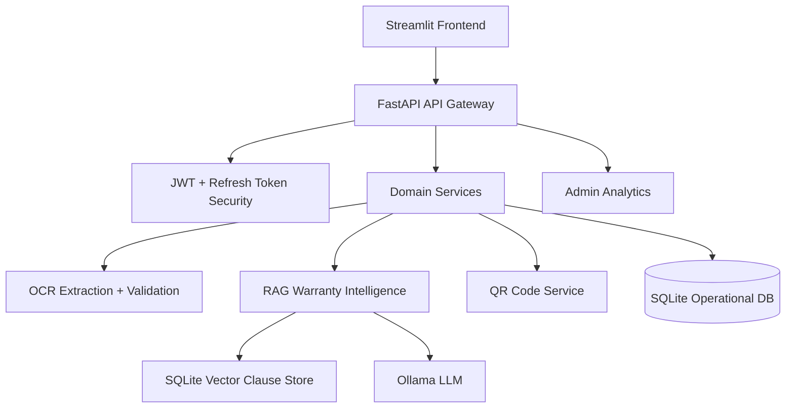

# Architecture Diagram

```mermaid
flowchart TD
    UI[Streamlit Frontend] --> API[FastAPI API Gateway]
    API --> AUTH[JWT + Refresh Token Security]
    API --> SVC[Domain Services]
    SVC --> OCR[OCR Extraction + Validation]
    SVC --> RAG[RAG Warranty Intelligence]
    RAG --> VDB[SQLite Vector Clause Store]
    RAG --> OLLAMA[Ollama LLM]
    SVC --> QR[QR Code Service]
    SVC --> DB[(SQLite Operational DB)]
    API --> ADMIN[Admin Analytics]
```
