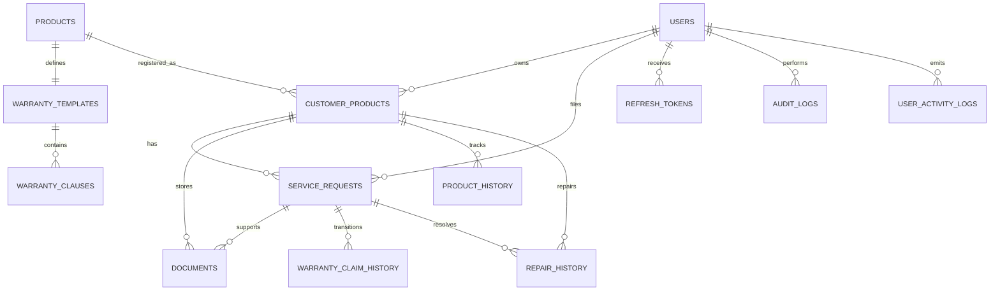

# ER Diagram

```mermaid
erDiagram
    USERS ||--o{ CUSTOMER_PRODUCTS : owns
    USERS ||--o{ SERVICE_REQUESTS : files
    USERS ||--o{ REFRESH_TOKENS : receives
    PRODUCTS ||--|| WARRANTY_TEMPLATES : defines
    PRODUCTS ||--o{ CUSTOMER_PRODUCTS : registered_as
    WARRANTY_TEMPLATES ||--o{ WARRANTY_CLAUSES : contains
    CUSTOMER_PRODUCTS ||--o{ SERVICE_REQUESTS : has
    CUSTOMER_PRODUCTS ||--o{ DOCUMENTS : stores
    CUSTOMER_PRODUCTS ||--o{ PRODUCT_HISTORY : tracks
    CUSTOMER_PRODUCTS ||--o{ REPAIR_HISTORY : repairs
    SERVICE_REQUESTS ||--o{ DOCUMENTS : supports
    SERVICE_REQUESTS ||--o{ WARRANTY_CLAIM_HISTORY : transitions
    SERVICE_REQUESTS ||--o{ REPAIR_HISTORY : resolves
    USERS ||--o{ AUDIT_LOGS : performs
    USERS ||--o{ USER_ACTIVITY_LOGS : emits
```
