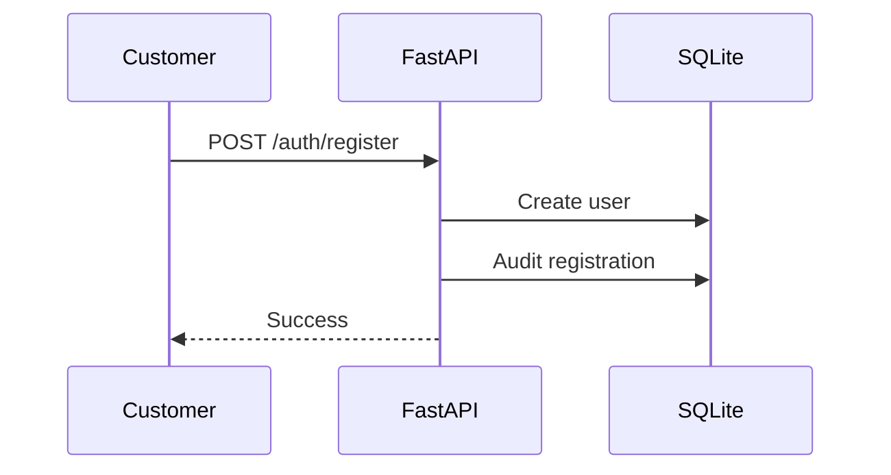
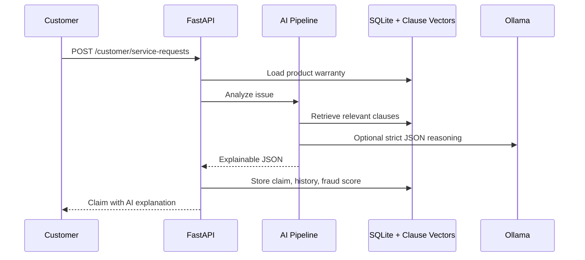
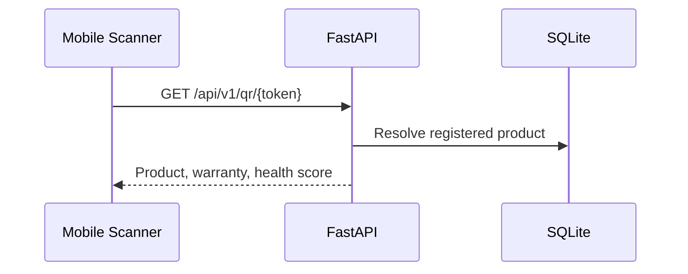
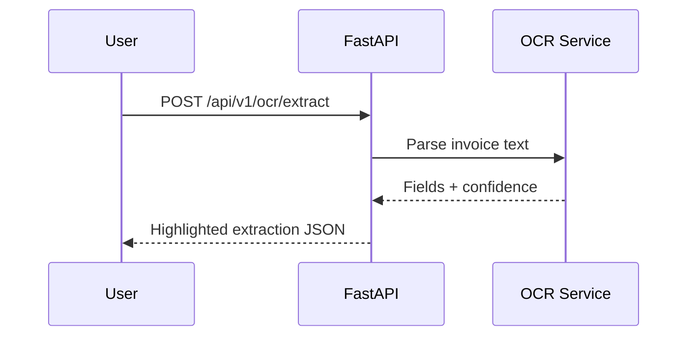

# Sequence Diagrams

## Registration

```mermaid
sequenceDiagram
    participant C as Customer
    participant API as FastAPI
    participant DB as SQLite
    C->>API: POST /auth/register
    API->>DB: Create user
    API->>DB: Audit registration
    API-->>C: Success
```

## Warranty Analysis

```mermaid
sequenceDiagram
    participant C as Customer
    participant API as FastAPI
    participant RAG as AI Pipeline
    participant DB as SQLite + Clause Vectors
    participant LLM as Ollama
    C->>API: POST /customer/service-requests
    API->>DB: Load product warranty
    API->>RAG: Analyze issue
    RAG->>DB: Retrieve relevant clauses
    RAG->>LLM: Optional strict JSON reasoning
    RAG-->>API: Explainable JSON
    API->>DB: Store claim, history, fraud score
    API-->>C: Claim with AI explanation
```

## QR Scan

```mermaid
sequenceDiagram
    participant M as Mobile Scanner
    participant API as FastAPI
    participant DB as SQLite
    M->>API: GET /api/v1/qr/{token}
    API->>DB: Resolve registered product
    API-->>M: Product, warranty, health score
```

## OCR Upload

```mermaid
sequenceDiagram
    participant U as User
    participant API as FastAPI
    participant OCR as OCR Service
    U->>API: POST /api/v1/ocr/extract
    API->>OCR: Parse invoice text
    OCR-->>API: Fields + confidence
    API-->>U: Highlighted extraction JSON
```
